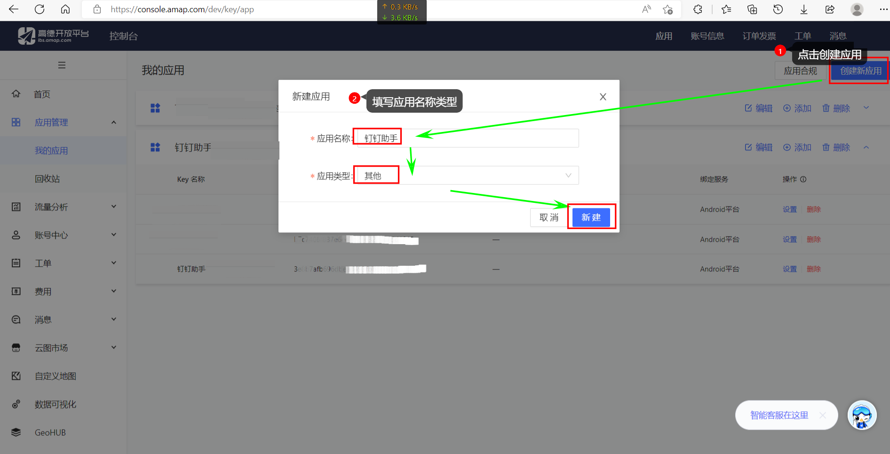
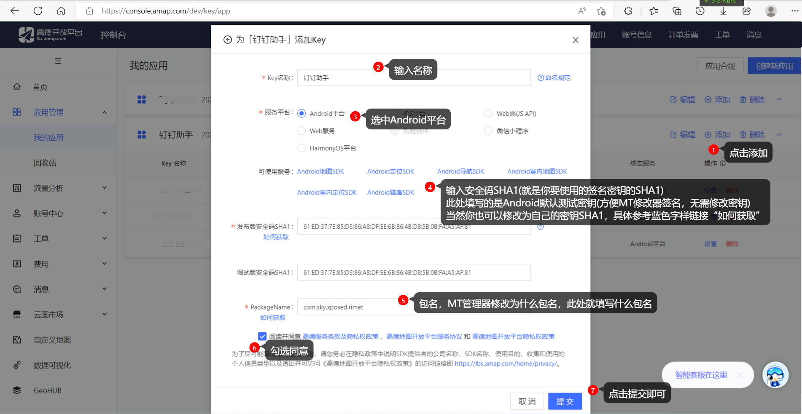

# Xposed-Rimet

###### 这是一个钉钉的Xposed插件

## 主要功能
+ *此部分需要根据版本适配*  ~~新版钉钉方法变动暂不支持~~
    + ~~红包自动打开和领取~~
    + ~~消息防撤回~~
    + 太极不支持上述功能了(由于注入时机问题，导致hook失效)

+ *此部分所有版本通用，无需适配(配置可导入、导出)*
    + 定位模拟(高德SDK Hook)
    + WIFI模拟
    + 手机基站模拟
    + ~~钉钉版本号修改~~

## Download
### Xposed Module Repository
[http://repo.xposed.info/module/com.sky.xposed.rimet](http://repo.xposed.info/module/com.sky.xposed.rimet)

### Telegram
[https://t.me/s/DingTalkHelper](https://t.me/s/DingTalkHelper)

## Other Links
#### Software Communication Platform
[https://t.me/s/fun_apk](https://t.me/s/fun_apk)

##### MTPROTO公益TG代理发布频道
[https://t.me/s/onessr](https://t.me/s/onessr)

##### V2ray,Vmess节点免费发放🚀
[https://t.me/s/V2List](https://t.me/s/V2List)

##### Telegram 客户端中文汉化
[tg://setlanguage?lang=zhcncc](tg://setlanguage?lang=zhcncc)

## 如何使用自己的高德key？
(以下部分不支持`太极APP`，因为它的插件需要开发者上传并审核保持签名一致才行。所以如有需求请使用`应用转生`、`LSPatch`、`JSHOOK`等其他虚拟框架)

助手采用的高德地图定位插件，由于国家[个人信息保护法](https://lbs.amap.com/pages/privacy/) 实施，高德隐私声明要求必须升级SDK，以及规范使用key，故望各位都使用自己的高德key，本月度过后本分支下key会删除，望周知。
自定义修改高德key的几个步骤：
- 注册高德(开发者)账号
- 填写应用信息，申请key
- mt管理器修改应用内key
- mt默认签名应用(testkey签名)

### 注册高德(开发者)账号
[开发者管理台](https://lbs.amap.com/?ref=https://console.amap.com)，可以使用支付宝、QQ、微博、淘宝账号登录，当然原来有高德账号的可以直接登录开发者管理台。此处不赘述。

### 填写应用信息，申请key
*创建应用*

*添加应用包*

*复制key*

### mt管理器修改应用内key
### mt默认签名应用(testkey签名)
- 测试key SHA1: 61:ED:37:7E:85:D3:86:A8:DF:EE:6B:86:4B:D8:5B:0B:FA:A5:AF:81
  
  - 修改包名(**可以不修改包名，替换key就行**)
    - 此处注意！！！(以下假设改成`com.github.anysoft.ding`，实际根据自己需求替换即可)
    - 如果要修改包名(防止钉钉检查，实现个性化包名)，`高德开发者中心`、`APK应用包名`、`classes.dex内包名`此三处均需要修改
      - `高德开发者中心`，自己去改对应的包名即可`com.github.anysoft.ding``
      - ``APK应用包名`，使用`mt管理器` APK共存功能修改包名为`com.github.anysoft.ding`
      - `classes.dex内包名`，用`mt管理器`点击助手APK选`查看`，点击`classes.dex`选择`DEX编辑器++`  --> `搜索` --> `发起新搜索`  --> `com.sky.xposed.rimet` (一起7处) --> `在当前结果中替换` -->`com.github.anysoft.ding` --> `确认`返回即可
  
  - 修改高德key
  - 重新签名 
  - 可以参考此视频  [修改高德key、重新签名](./screenshot/replaceKeyAndSign.mp4) 
  - 可以参考此视频  [修改高德key、修改包名、重新签名](./screenshot/modifypackageandkey.mp4)
  

<video id="video" controls="" preload="none" poster="作者(图片地址)">
<source id="mp4" src="./screenshot/mt.mp4" type="video/mp4">
</video>

## Security

+ [【钉钉官方】哪些是虚拟定位软件？](https://csmobile.alipay.com/detailSolution.htm?knowledgeType=1&scene=dd_kq&questionId=201602254880)

  *钉钉全面升级了考勤安全防护，智能识别有安全风险的考勤行为。当公司开启禁止使用恶意软件的规则后，系统将在用户打卡时，对使用虚拟定位软件的用户进行智能拦截。拦截后，将记录此次打卡行为，并升级为人脸识别，或禁止打卡。*
  *虚拟定位软件包含以下软件：*
  *位移空间、任我行、神行者、天下游、大牛、大牛助手、钉钉打卡精灵、钉钉定位精灵、钉钉打卡工具、天下任我行、西瓜皮、海鱼魔器、虚拟定位精灵、打卡签到神器、虚拟定位打卡、Virtual Hook、Fake Location、Xposed插件*

+ 暂无检测

    + 太极

    + Edxposed

    + 钉钉助手

## 更新日志

### 2022年08月19日 20点45分

1. 更新`amap sdk` `AMap2DMap_6.0.0_AMapSearch_9.2.0_AMapLocation_6.1.0_20220414.jar`
2. 添加`testkey.jks`(Android通用测试key)到项目
3. 项目目录下执行 `.\gradlew.bat clean assembleRelease` 可以自动打包成 `apk`

## License

    Copyright 2019 The sky Authors
    
    Licensed under the Apache License, Version 2.0 (the "License");
    you may not use this file except in compliance with the License.
    You may obtain a copy of the License at
    
       http://www.apache.org/licenses/LICENSE-2.0
    
    Unless required by applicable law or agreed to in writing, software
    distributed under the License is distributed on an "AS IS" BASIS,
    WITHOUT WARRANTIES OR CONDITIONS OF ANY KIND, either express or implied.
    See the License for the specific language governing permissions and
    limitations under the License.

## 